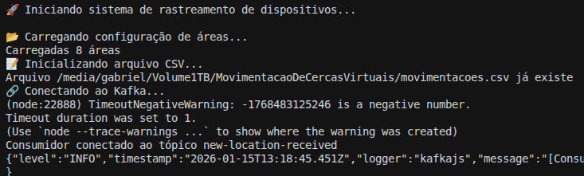
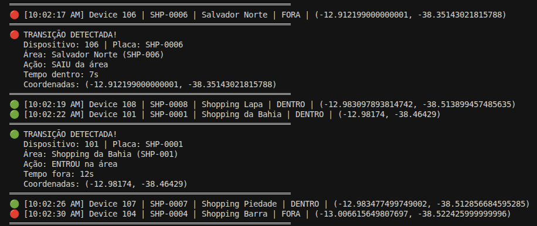
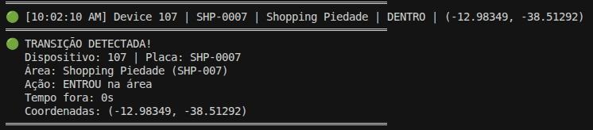
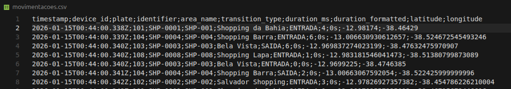
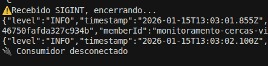

# Monitoramento de Cercas Virtuais

Sistema de monitoramento em tempo real de dispositivos GPS que detecta quando veículos entram ou saem de áreas geográficas definidas (cercas virtuais).

## Sobre o Projeto

Este sistema consome mensagens de localização de dispositivos através do Apache Kafka, verifica se os dispositivos estão dentro ou fora de áreas pré-definidas e registra todas as transições (entradas e saídas) em um arquivo CSV.

## Funcionalidades

- **Monitoramento em tempo real** de dispositivos via Kafka
- **Detecção de cercas virtuais** baseada em coordenadas GPS
- **Registro de transições** (entrada/saída de áreas) em CSV
- **Cálculo de permanência** em cada área
- **Suporte a múltiplas áreas** configuradas via GeoJSON
- **Logs estruturados** e informativos
- **Shutdown graceful** com desconexão segura do Kafka

## Tecnologias

- **TypeScript** - Linguagem de programação
- **Node.js** - Runtime JavaScript
- **KafkaJS** - Cliente Apache Kafka
- **GeoJSON** - Formato de áreas geográficas
- **ESLint** - Linter para TypeScript
- **Prettier** - Formatador de código
- **tsx** - Executor TypeScript para desenvolvimento

## Instalação

1. Clone o repositório:
    ```bash 
    git clone https://github.com/GabrielDev969/MovimentacaoDeCercasVirtuais.git
    cd MovimentacaoDeCercasVirtuais
    ```

2. Instale as dependências:
    ```bash 
    npm install
    ```

3. Compile o projeto TypeScript:
    ```bash 
    npm run build
    ```

## Configuração

1. Crie a pasta `certificados` na raiz do projeto e adicione os certificados SSL:
    ```bash 
    mkdir certificados
    ```

2. Coloque os seguintes arquivos de certificado na pasta certificados/:

    - `ca-cert.pem` - Certificado da autoridade certificadora (CA)
    - `client.key` - Chave privada do cliente
    - `client.crt` - Certificado do cliente

    **Importante**: Certifique-se de que os nomes dos arquivos correspondem aos caminhos configurados no arquivo .env.

3. Copie o arquivo `.env.example` para `.env`
    ```env
    # Configuração do Kafka
    KAFKA_BROKERS=broker1:9093
    KAFKA_TOPIC=new-location-received
    KAFKA_GROUP_ID=grupo-consumidor
    KAFKA_CLIENT_ID=monitoramento-cercas-virtuais

    # Caminhos dos certificados SSL (obrigatórios)
    KAFKA_CA_CERTIFICATE_PATH=certificados/ca-cert.pem
    KAFKA_KEY_CERTIFICATE_PATH=certificados/user.key
    KAFKA_CERTIFICATE_PATH=certificados/user.crt

    # Senha da chave privada
    KAFKA_KEY_PASSWORD=sua-senha-aqui
    ```

## Uso

```bash
# Executar em modo produção
npm run build
npm start

# Executar em modo desenvolvimento (com watch)
npm run dev
```

## Scripts Disponíveis

| Script | Descrição |
|--------|-----------|
| `npm run build` | Compila o TypeScript para JavaScript |
| `npm start` | Executa o sistema em produção |
| `npm run dev` | Executa em modo desenvolvimento com watch |
| `npm run lint` | Verifica erros de linting |
| `npm run lint:fix` | Corrige automaticamente erros de linting |
| `npm run format` | Formata o código com Prettier |
| `npm run format:check` | Verifica se o código está formatado |
| `npm run type-check` | Verifica tipos sem compilar |

## Demonstração

### Inicialização do Sistema

Ao iniciar, o sistema realiza verificações de configuração e conecta ao Kafka:



O sistema verifica:
- ✅ Carregamento das áreas geográficas do arquivo GeoJSON
- ✅ Inicialização do arquivo CSV de movimentações
- ✅ Conexão com o Apache Kafka
- ✅ Subscrição ao tópico configurado

### Logs em Tempo Real

Durante a execução, o sistema exibe logs detalhados de cada dispositivo:



Os logs mostram:
- 🟢 **DENTRO** - Dispositivo está dentro da área
- 🔴 **FORA** - Dispositivo está fora da área
- 📍 Coordenadas GPS (latitude, longitude)
- 🚗 Identificação do dispositivo e placa
- 🏢 Nome da área monitorada

### Detecção de Transições

Quando um dispositivo entra ou sai de uma área, o sistema detecta e registra a transição:



Cada transição inclui:
- Tipo de transição (ENTRADA ou SAÍDA)
- Tempo de permanência na área anterior
- Coordenadas exatas da transição
- Informações completas do dispositivo

### Salvamento no CSV

Todas as transições são automaticamente salvas no arquivo `movimentacoes.csv`:



O arquivo contém:
- Timestamp da transição
- ID do dispositivo e placa
- Nome e identificador da área
- Tipo de transição (ENTRADA/SAÍDA)
- Duração formatada
- Coordenadas GPS

### Encerramento do Sistema

Ao desativar o sistema (Ctrl+C), ele desconecta do Kafka de forma segura:



O sistema:
- Recebe o sinal de interrupção (SIGINT)
- Desconecta o consumidor Kafka
- Finaliza todas as operações de forma limpa